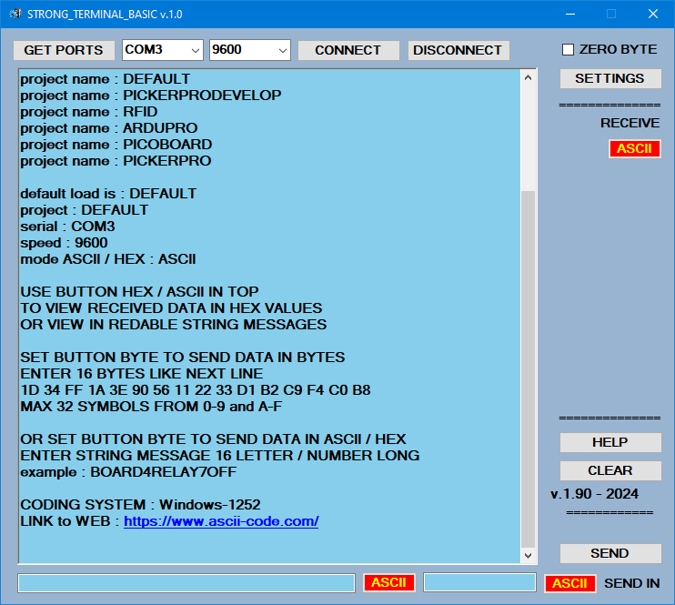
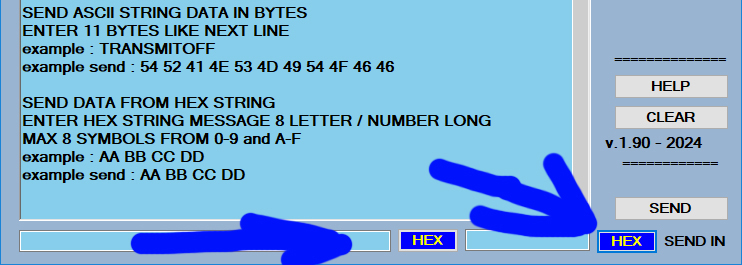
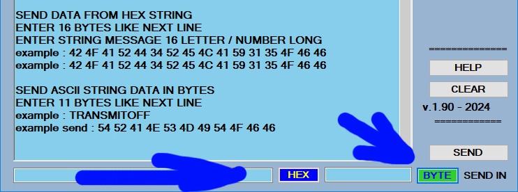
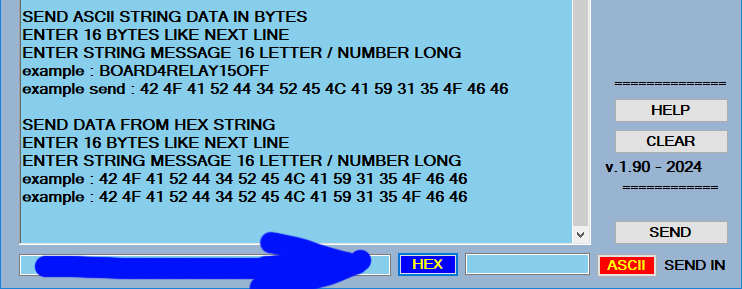
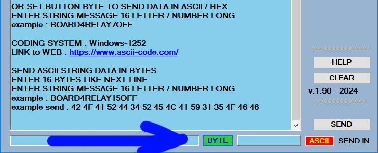
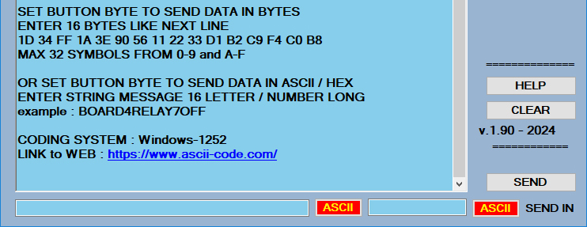

STRONG TERMINAL BASIC

program is serial RS232 terminal for windows 10 and other. can be used for send receive data trough com ports the are active on any computer / laptop.

have a three way to send data :
1. ASCII string symbols code page : Windows-1252.
2. ASCII string symbols converted to them BYTES values according ASCII table.
3. HEX STRING convereted directly to same HEX BYTES VALUES SENDED TROUGH SERIAL COM PORT

====     HAVE AND NEW FUNCTION ============

IN SECOND TEXT FIELD CAN INPUT AND SEND STRING DATA LIKE A LAST 4 BYTES AFTER A MAIN STRING / DATA
this cna be used in some systems like NEXTION HMI TOUCH DISPLAYS, when device prorocol is needed to have a tail with some bytes

in second field you can set a bytes, that always are same for the device protocol. example : FF FF FF CC will be end transmision flag for device protocol.

in your work you can use many stron terminal programs on you desktop started in same time. if you have virtual serial protocols, you can test what is send is that is received in second terminal. also can use other serial terminals to check proper communication.

